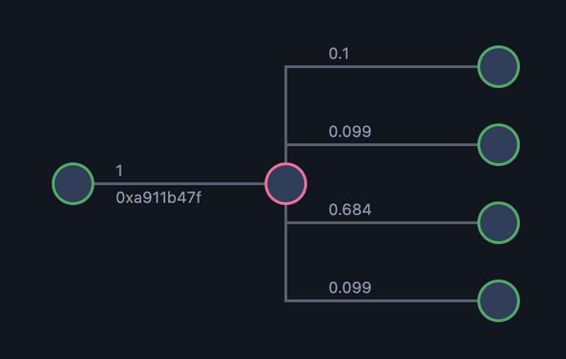

## Writing Tests for Tact

This page demonstrate writing test for Tact contracts created in with [Blueprint](https://github.com/ton-org/blueprint) ([Sandbox](https://github.com/ton-org/sandbox)). 
Test suites built for demo contract [Fireworks](https://github.com/reveloper/tact-fireworks/blob/main/contracts/fireworks.tact). The fireworks expect to receive message with 'Launch' command, which handled to send back leasts funds with separate message with different sendmodes.

Once a new Tact project is created via `npm create ton@latest`, a test file `test/contract.ts.spec` will be autogenerated in the project directory for testing the contract:

```typescript
import ...

describe('Fireworks', () => {
...
        

        expect(deployResult.transactions).toHaveTransaction({
...
        });
    
});

it('should deploy', async () => {
    // the check is done inside beforeEach
    // blockchain and fireworks are ready to use
});
```


Running tests using the following command:

```bash
npx blueprint test
```


### Transaction Success Test

This test checks if the fireworks are successfully launched by sending a transaction with a value of 1 TON (converted to nanoTON) and the 'Launch' type. It then checks if the transaction was successful by validating the `from`, `to`, and `success` fields using the transaction matcher.

```typescript


    it('should launch fireworks', async () => {

            const launcher = await blockchain.treasury('fireworks');
            console.log('launcher = ', launcher.address);
            console.log('Fireworks = ', fireworks.address);


            const launchResult = await fireworks.send(
                launcher.getSender(),
                {
                    value: toNano('1'),
                },
                {
                    $$type: 'Launch',
                }
            );

            expect(launchResult.transactions).toHaveTransaction({
                from: launcher.address,
                to: fireworks.address,
                success: true,
            });
    });
    
```


### Account Status Tests

This test checks if the contract is destroyed after launching the fireworks.

```typescript

    it('should destroy after launching', async () => {

        const launcher = await blockchain.treasury('fireworks');

        const launchResult = await fireworks.send(
            launcher.getSender(),
            {
                value: toNano('1'),
            },
            {
                $$type: 'Launch',
            }
        );

        expect(launchResult.transactions).toHaveTransaction({
            from: launcher.address,
            to: fireworks.address,
            success: true,
            endStatus: 'non-existing',
            destroyed: true
        });

    });
    
```

The full list of Account Status related fields:

* `destroyed` - `true` - if the existing contract was destroyed due to executing a certain transaction. Otherwise - `false`.
* `deploy` - Custom Sandbox flag that indicates whether the contract was deployed during this transaction. `true` if contract before this transaction was not initialized and after this transaction became initialized. Otherwise - `false`.
* `oldStatus` - AccountStatus before transaction execution. Values: `'uninitialized'`, `'frozen'`, `'active'`, `'non-existing'`.
* `endStatus` - AccountStatus after transaction execution. Values: `'uninitialized'`, `'frozen'`, `'active'`, `'non-existing'`.


### Operation Code Tests

This test shows how to check whether the operation code (op code) of incoming message is equal to the expected op code.

```typescript

    it('should be correct Launch op code for the launching', async () => {

        const launcher = await blockchain.treasury('fireworks');

        const launchResult = await fireworks.send(
            launcher.getSender(),
            {
                value: toNano('1'),
            },
            {
                $$type: 'Launch',
            }
        );

        expect(launchResult.transactions).toHaveTransaction({
            from: launcher.address,
            to: fireworks.address,
            success: true,
            op: 0xa911b47f // 'Launch' op code
        });

        expect(launchResult.transactions).toHaveTransaction({
            from: fireworks.address,
            to: launcher.address,
            success: true,
            op: 0 // 0x00000000 - comment op code
        });

    });
```

> For Tact contracts, crc32 representation could be found in the project build directory, autogenerated with build contract.md file.
> Read more about [crc32](https://docs.ton.org/develop/data-formats/crc32) and op codes in the TON documentation.

### Message Counter Tests

This test checks if the correct number of messages are sent in the transaction.

```typescript
    it('should send 4 messages to wallet', async() => {

        const launcher = await blockchain.treasury('fireworks');

        const launchResult = await fireworks.send(
            launcher.getSender(),
            {
                value: toNano('1'),
            },
            {
                $$type: 'Launch',
            }
        );

        expect(launchResult.transactions).toHaveTransaction({
            from: launcher.address,
            to: fireworks.address,
            success: true,
            outMessagesCount: 4
        });
    })
```


### Multi Transaction and Payload Tests

This test checks if the fireworks contract sends multiple messages with comments correctly. The body field contains a Cell that is built with @ton/core primitives.


```typescript

    it('fireworks contract should send msgs with comments', async() => {

        const launcher = await blockchain.treasury('fireworks');

        const launchResult = await fireworks.send(
            launcher.getSender(),
            {
                value: toNano('1'),
            },
            {
                $$type: 'Launch',
            }
        );


        expect(launchResult.transactions).toHaveTransaction({
            from: fireworks.address,
            to: launcher.address,
            success: true,
            body: beginCell().storeUint(0,32).storeStringTail("send mode = 0").endCell() // 0x00000000 comment opcode and encoded comment

        });

            expect(launchResult.transactions).toHaveTransaction({
            from: fireworks.address,
            to: launcher.address,
            success: true,
            body: beginCell().storeUint(0,32).storeStringTail("send mode = 1").endCell()
        });

        expect(launchResult.transactions).toHaveTransaction({
            from: fireworks.address,
            to: launcher.address,
            success: true,
            body: beginCell().storeUint(0,32).storeStringTail("send mode = 2").endCell()
        });

        expect(launchResult.transactions).toHaveTransaction({
            from: fireworks.address,
            to: launcher.address,
            success: true,
            body: beginCell().storeUint(0,32).storeStringTail("send mode = 128 + 32").endCell()
        });
    })
    
```

### Printing and Reading Transaction Fees

During the test, reading the details about fees can be useful for optimizing the contract. The printTransactionFees function prints the entire transaction chain in a convenient manner."
```typescript

it('should be executed and print fees', async() => {

    const launcher = await blockchain.treasury('fireworks');

    const launchResult = await fireworks.send(
        launcher.getSender(),
        {
            value: toNano('1'),
        },
        {
            $$type: 'Launch',
        }
    );

    console.log(printTransactionFees(launchResult.transactions));

});

```

For instance, in case of `launchResult` the following table will be printed:

    ┌─────────┬──────────────┬────────────────┬────────────────┬────────────────┬────────────────┬───────────────┬────────────┬────────────────┬──────────┬────────────┐
    │ (index) │      op      │    valueIn     │    valueOut    │   totalFees    │  inForwardFee  │ outForwardFee │ outActions │   computeFee   │ exitCode │ actionCode │
    ├─────────┼──────────────┼────────────────┼────────────────┼────────────────┼────────────────┼───────────────┼────────────┼────────────────┼──────────┼────────────┤
    │    0    │    'N/A'     │     'N/A'      │    '1 TON'     │ '0.003935 TON' │     'N/A'      │  '0.001 TON'  │     1      │ '0.001937 TON' │    0     │     0      │
    │    1    │ '0xa911b47f' │    '1 TON'     │ '0.980644 TON' │ '0.016023 TON' │ '0.000667 TON' │  '0.005 TON'  │     4      │ '0.014356 TON' │    0     │     0      │
    │    2    │    '0x0'     │ '0.098764 TON' │    '0 TON'     │ '0.000309 TON' │ '0.000825 TON' │     'N/A'     │     0      │ '0.000309 TON' │    0     │     0      │
    │    3    │    '0x0'     │   '0.1 TON'    │    '0 TON'     │ '0.000309 TON' │ '0.000825 TON' │     'N/A'     │     0      │ '0.000309 TON' │    0     │     0      │
    │    4    │    '0x0'     │ '0.098764 TON' │    '0 TON'     │ '0.000309 TON' │ '0.000825 TON' │     'N/A'     │     0      │ '0.000309 TON' │    0     │     0      │
    │    5    │    '0x0'     │ '0.683116 TON' │    '0 TON'     │ '0.000309 TON' │ '0.000862 TON' │     'N/A'     │     0      │ '0.000309 TON' │    0     │     0      │
    └─────────┴──────────────┴────────────────┴────────────────┴────────────────┴────────────────┴───────────────┴────────────┴────────────────┴──────────┴────────────┘



index - is an ID of a transaction in the launchResult array.
* `0` - External request to the treasury (the Launcher) that resulted in a message to Fireworks
* `1` - The Fireworks transaction that resulted in 4 messages to the Launcher
* `2` - Transaction on Launcher with incoming message from Fireworks, message sent with `send mode = 0`
* `3` - Transaction on Launcher with incoming message from Fireworks, message sent with `send mode = 1`
* `4` - Transaction on Launcher with incoming message from Fireworks, message sent with `send mode = 2`
* `5` - Transaction on Launcher with incoming message from Fireworks, message sent with `send mode = 128 + 32`


### Transaction Fees Tests

This test verifies whether the transaction fees for launching the fireworks are as expected. It is possible to define custom assertions for different parts of commission fees.

```typescript

    it('should be executed with expected fees', async() => {

        const launcher = await blockchain.treasury('fireworks');

        const launchResult = await fireworks.send(
            launcher.getSender(),
            {
                value: toNano('1'),
            },
            {
                $$type: 'Launch',
            }
        );
        
        //totalFee
        console.log('total fees = ', launchResult.transactions[1].totalFees);

        const tx1 = launchResult.transactions[1];
        if (tx1.description.type !== 'generic') {
            throw new Error('Generic transaction expected');
        }

        //computeFee
        const computeFee = tx1.description.computePhase.type === 'vm' ? tx1.description.computePhase.gasFees : undefined;
        console.log('computeFee = ', computeFee);

        //actionFee
        const actionFee = tx1.description.actionPhase?.totalActionFees;
        console.log('actionFee = ', actionFee);

        //The check, if Compute Phase and Action Phase fees exceed 1 TON
        expect(computeFee + actionFee).toBeLessThan(toNano('1'));
        

    });


```


